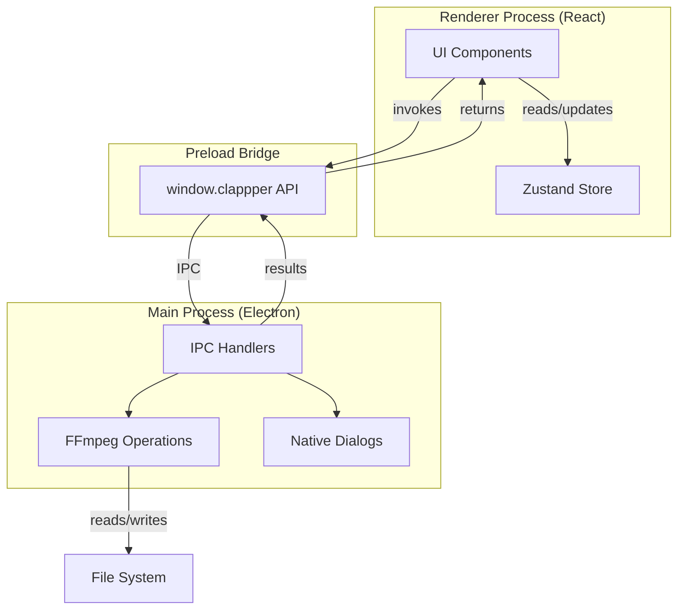
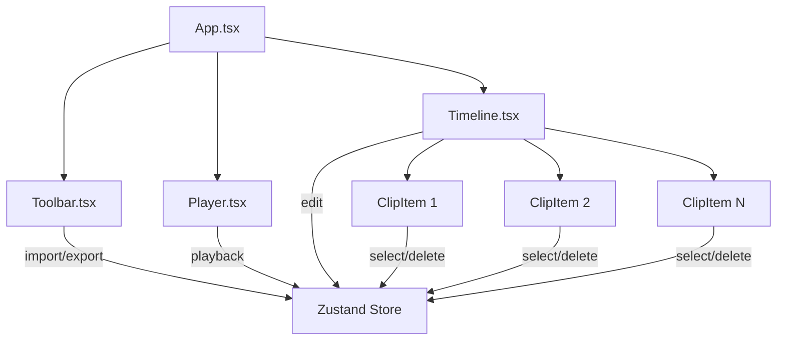
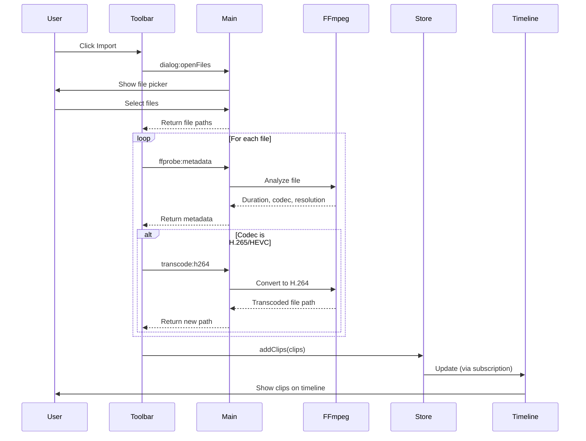
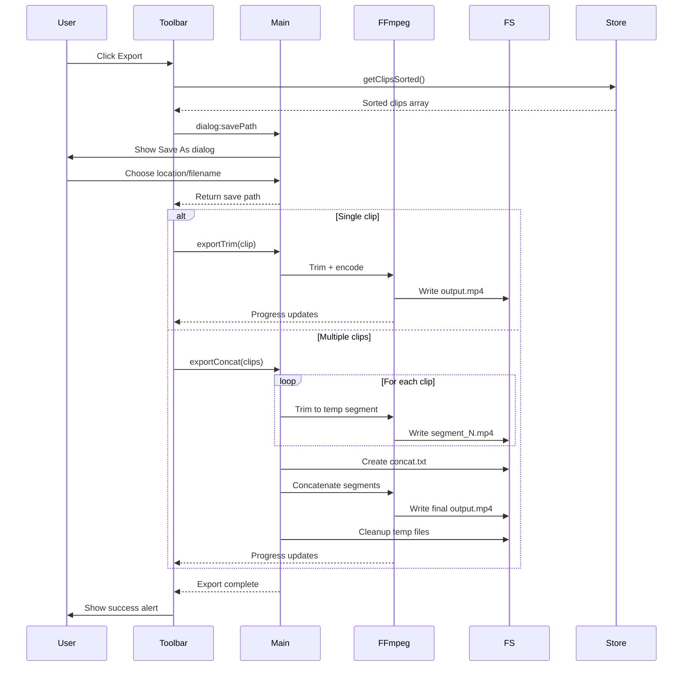
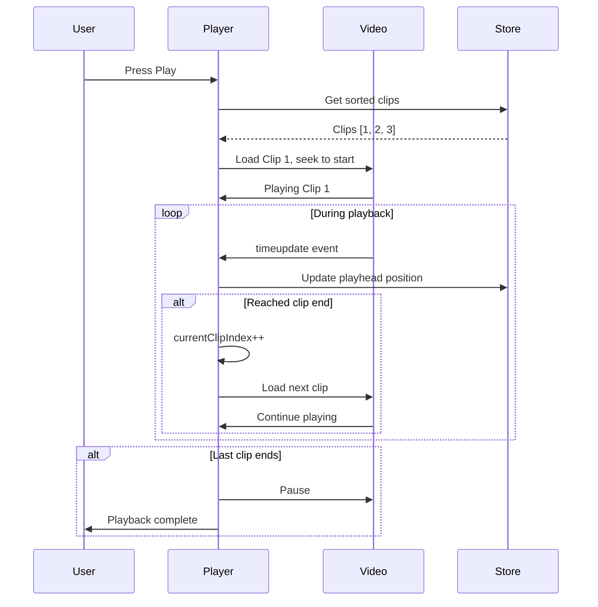

# Clappper Architecture

## System Overview



## Component Architecture



## Data Flow: Import Clips



## Data Flow: Export Sequence



## Data Flow: Sequence Playback



## State Management (Zustand)

```mermaid
graph LR
    subgraph "Store State"
        Tracks[tracks: Track[]]
        SelectedId[selectedId: string]
        Playhead[playhead: number]
        PipSettings[pipSettings: PipSettings]
        VisibleOverlays[visibleOverlayCount: number]
    end
    
    subgraph "Actions"
        AddClips[addClips]
        SetTrim[setTrim]
        ReorderClips[reorderClips]
        SplitClip[splitClip]
        DeleteClip[deleteClip]
        MoveClipToTrack[moveClipToTrack]
        SetPipSettings[setPipSettings]
        Select[select]
    end
    
    subgraph "Selectors"
        GetMainTrack[getMainTrack]
        GetOverlayTracks[getOverlayTracks]
        GetTotal[getTotalDuration]
    end
    
    AddClips -->|updates| Tracks
    SetTrim -->|updates| Tracks
    ReorderClips -->|updates| Tracks
    SplitClip -->|creates new| Tracks
    DeleteClip -->|removes from| Tracks
    MoveClipToTrack -->|updates| Tracks
    SetPipSettings -->|updates| PipSettings
    Select -->|updates| SelectedId
    
    GetMainTrack -->|reads| Tracks
    GetOverlayTracks -->|reads| Tracks
    GetTotal -->|reads| Tracks
```

## IPC API Surface

### Renderer → Main

| Channel | Purpose | Parameters | Returns |
|---------|---------|------------|---------|
| `dialog:openFiles` | Open file picker | - | `string[]` (file paths) |
| `dialog:savePath` | Save As dialog | `defaultName: string` | `string \| null` |
| `ffprobe:metadata` | Get video info | `filePath: string` | `{ format, streams }` |
| `transcode:h264` | Convert to H.264 | `{ input, output }` | `{ ok, output }` |
| `export:trim` | Export single clip | `{ input, outPath, start, end }` | `{ ok, outPath }` |
| `export:concat` | Export multi-clip | `{ clips[], outPath }` | `{ ok, outPath }` |
| `export:pip` | Export with PiP overlay | `{ mainClip, overlayClip, outPath, pipPosition, pipSize, keyframes?, customX?, customY? }` | `{ ok, outPath }` |

### Main → Renderer

| Channel | Purpose | Data |
|---------|---------|------|
| `export:progress` | Export progress | `percent: number` |
| `transcode:progress` | Transcode progress | `percent: number` |

## File System Layout

```
User's Project:
├── video1.mp4                    # Original import
├── video1.mp4.h264.mp4           # Transcoded (if needed)
├── video2.mov                    # Original import
└── clappper_export.mp4           # Final export

During Export (temporary):
├── .clappper_temp_123456/
│   ├── segment_0.mp4             # Trimmed clip 1
│   ├── segment_1.mp4             # Trimmed clip 2
│   ├── segment_2.mp4             # Trimmed clip 3
│   └── concat.txt                # FFmpeg concat list
└── (deleted after export)
```

## Data Models

```typescript
interface Clip {
  id: string              // UUID
  path: string            // File system path (possibly transcoded)
  name: string            // Display name (filename)
  originalPath?: string   // Original file (if transcoded)
  duration: number        // Total video duration (seconds)
  start: number           // Trim in-point (seconds)
  end: number             // Trim out-point (seconds)
  order: number           // Position in timeline (0, 1, 2, ...)
  trackId: string         // Which track this clip belongs to
  width?: number          // Video resolution width
  height?: number         // Video resolution height
}

interface Track {
  id: string              // 'main', 'overlay-1', 'overlay-2', etc.
  name: string            // Display name
  type: 'video' | 'overlay'
  clips: Clip[]           // Clips on this track
  height: number          // Visual height in timeline (px)
}

interface PipSettings {
  position: PipPosition   // 'bottom-right', 'top-left', 'center', 'custom'
  size: number            // 0.15 to 0.5 (15% to 50% of main video)
  keyframes: PipKeyframe[] // Position animation keyframes
  customX?: number        // Custom X position (0-1)
  customY?: number        // Custom Y position (0-1)
}

interface PipKeyframe {
  time: number            // Time in seconds
  x: number               // X position (0-1)
  y: number               // Y position (0-1)
  size: number            // Size at this keyframe
}
```

## FFmpeg Operations

### Trim Single Clip
```bash
ffmpeg -i input.mp4 \
  -ss <start> \
  -t <duration> \
  -c:v libx264 -preset veryfast -crf 23 \
  -c:a aac -b:a 128k \
  output.mp4
```

### Transcode to H.264
```bash
ffmpeg -i input.mp4 \
  -c:v libx264 -preset fast -crf 23 \
  -c:a aac -b:a 128k \
  -movflags +faststart \
  output.mp4
```

### Concatenate Multiple Clips
```bash
# 1. Create concat.txt:
file 'segment_0.mp4'
file 'segment_1.mp4'
file 'segment_2.mp4'

# 2. Concatenate:
ffmpeg -f concat -safe 0 -i concat.txt \
  -c copy \
  output.mp4
```

### Get Metadata
```bash
ffprobe -v quiet \
  -print_format json \
  -show_format \
  -show_streams \
  input.mp4
```

## Security Considerations

- **Context Isolation**: ✅ Enabled
- **Node Integration**: ❌ Disabled
- **Preload Script**: ✅ Only exposes specific IPC methods
- **CSP**: ✅ Configured for `file://` and `media://` protocols
- **Web Security**: Disabled in dev mode only (for local file access)

## Performance Optimizations

1. **Transcoding**: Only transcodes unsupported codecs (H.265, etc.)
2. **Timeline Scaling**: Clips scale down to fit viewport (max 1000px total)
3. **Playback**: Direct file:// URLs (no loading into memory)
4. **Export**: Stream processing (no loading full videos into memory)
5. **Temp Files**: Auto-cleanup after export

## Current Features (Phase 6 Complete!)

✅ **Multi-Track System**
- 1 Main track + 4 Overlay tracks
- Drag-and-drop between all tracks
- Configurable overlay track visibility (0-4)
- Color-coded track badges (purple, blue, green, orange)
- Scrollable timeline for many tracks

✅ **Advanced PiP System**
- Real-time PiP preview with synchronized playback (matches export)
- Free dragging of PiP windows
- 5 position presets + custom positioning
- Adjustable size (15-50%)
- Keyframe animation system
- Interpolated movement between keyframes
- Visual keyframe markers
- Multi-overlay export (up to 4 simultaneous PiPs)
- Audio fallback to overlay if main has no audio

✅ **Export Pipeline**
- Export modal with resolution and quality options
- Single clip trim
- Multi-clip concatenation
- Multi-overlay PiP with animated position/size
- FFmpeg filter_complex expressions
- Progress modal with animated bar (0-100%)
- Cancel export with cleanup
- Validation (blocks empty timeline, zero-duration clips)
- Error handling (disk space, permissions, codec issues)
- FFmpeg logging for debugging

✅ **Format Support**
- MP4, MOV, WebM, MKV, AVI
- Auto-transcode H.265/HEVC → H.264
- Codec detection and normalization
- WMP compatibility (yuv420p format)

✅ **Memory & Performance**
- Proper video element cleanup
- No memory leaks
- Efficient resource management

## Known Limitations

- No project persistence (clips cleared on refresh) - **Phase 7**
- No undo/redo - **Phase 7**
- No keyboard shortcuts - **Phase 7**
- No filmstrip thumbnails - **Phase 9**
- Per-overlay keyframes not yet supported (multi-overlay uses auto-positioning)
- Length/resolution mismatch handling - **Phase 9**

## Future Enhancements

See [`PRD_FULL_SUBMISSION.md`](./PRD_FULL_SUBMISSION.md) for detailed roadmap:
- **Phase 7:** Keyboard shortcuts, autosave, project persistence
- **Phase 8:** AI video enhancement (Real-ESRGAN)
- **Phase 9:** Advanced features & polish (deferred items)

