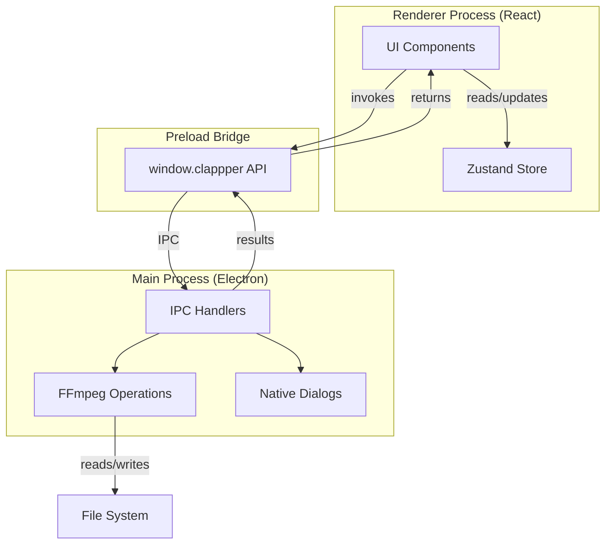
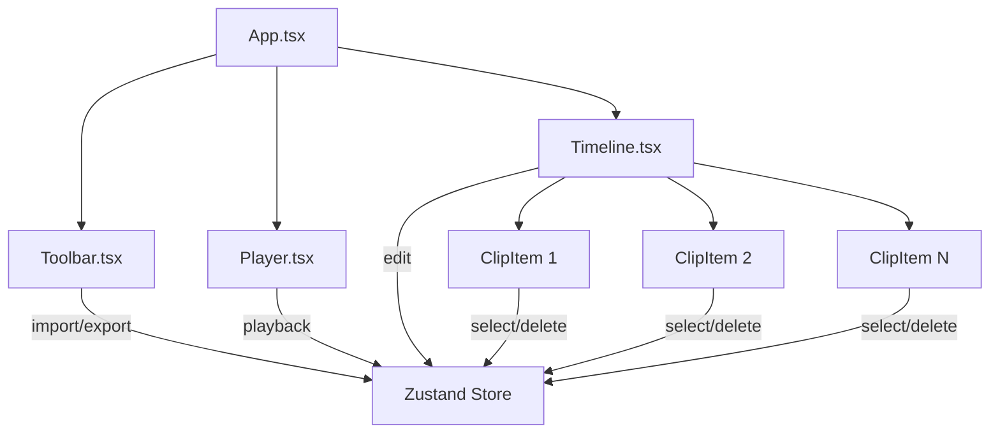
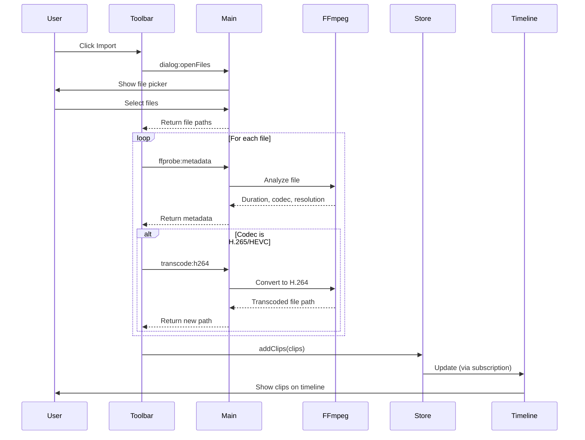
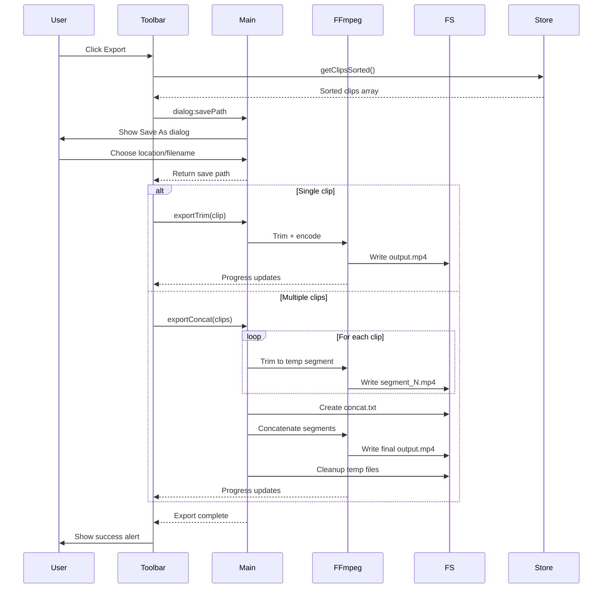
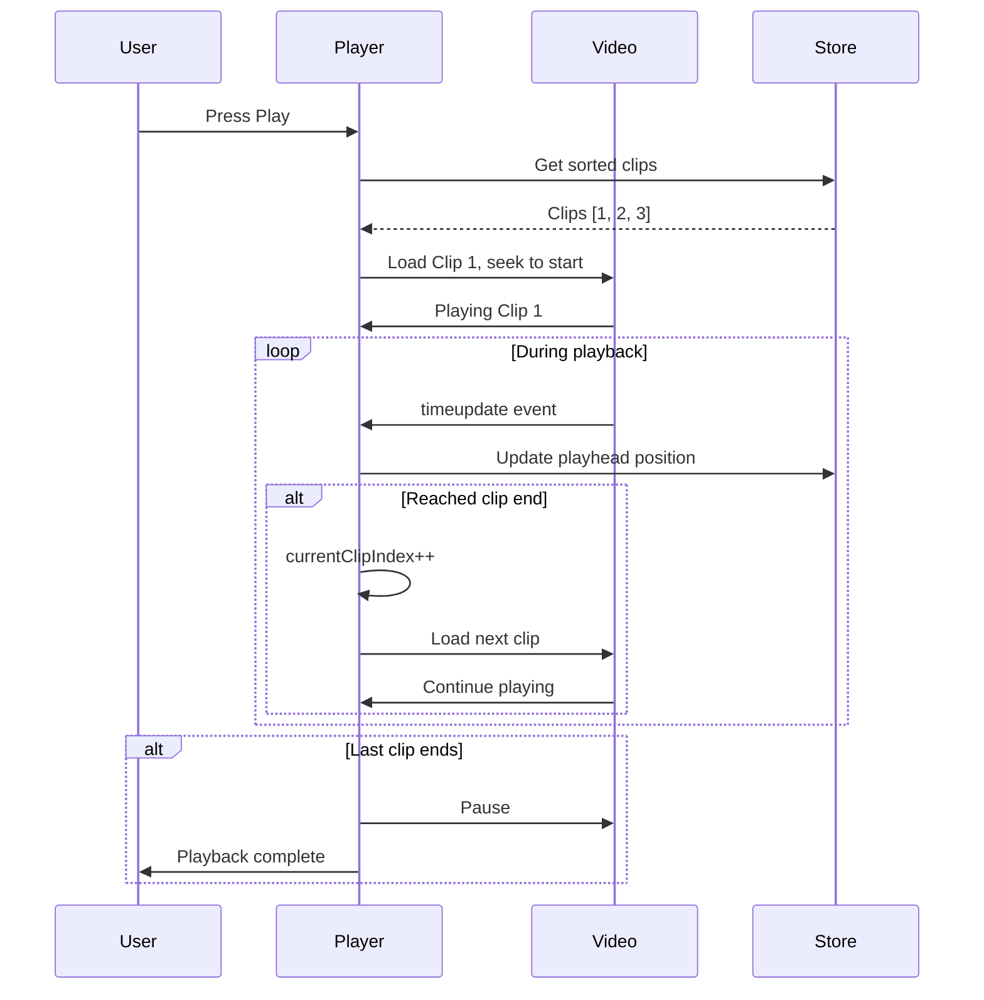

# Clappper Architecture

## System Overview



## Component Architecture



## Data Flow: Import Clips



## Data Flow: Export Sequence



## Data Flow: Sequence Playback



## State Management (Zustand)

```mermaid
graph LR
    subgraph "Store State"
        Clips[clips: Clip[]]
        SelectedId[selectedId: string]
        Playhead[playhead: number]
    end
    
    subgraph "Actions"
        AddClips[addClips]
        SetTrim[setTrim]
        ReorderClips[reorderClips]
        SplitClip[splitClip]
        DeleteClip[deleteClip]
        Select[select]
    end
    
    subgraph "Selectors"
        GetSorted[getClipsSorted]
        GetTotal[getTotalDuration]
    end
    
    AddClips -->|updates| Clips
    SetTrim -->|updates| Clips
    ReorderClips -->|updates| Clips
    SplitClip -->|creates new| Clips
    DeleteClip -->|removes from| Clips
    Select -->|updates| SelectedId
    
    GetSorted -->|reads| Clips
    GetTotal -->|reads| Clips
```

## IPC API Surface

### Renderer → Main

| Channel | Purpose | Parameters | Returns |
|---------|---------|------------|---------|
| `dialog:openFiles` | Open file picker | - | `string[]` (file paths) |
| `dialog:savePath` | Save As dialog | `defaultName: string` | `string \| null` |
| `ffprobe:metadata` | Get video info | `filePath: string` | `{ format, streams }` |
| `transcode:h264` | Convert to H.264 | `{ input, output }` | `{ ok, output }` |
| `export:trim` | Export single clip | `{ input, outPath, start, end }` | `{ ok, outPath }` |
| `export:concat` | Export multi-clip | `{ clips[], outPath }` | `{ ok, outPath }` |

### Main → Renderer

| Channel | Purpose | Data |
|---------|---------|------|
| `export:progress` | Export progress | `percent: number` |
| `transcode:progress` | Transcode progress | `percent: number` |

## File System Layout

```
User's Project:
├── video1.mp4                    # Original import
├── video1.mp4.h264.mp4           # Transcoded (if needed)
├── video2.mov                    # Original import
└── clappper_export.mp4           # Final export

During Export (temporary):
├── .clappper_temp_123456/
│   ├── segment_0.mp4             # Trimmed clip 1
│   ├── segment_1.mp4             # Trimmed clip 2
│   ├── segment_2.mp4             # Trimmed clip 3
│   └── concat.txt                # FFmpeg concat list
└── (deleted after export)
```

## Clip Data Model

```typescript
interface Clip {
  id: string              // UUID
  path: string            // File system path (possibly transcoded)
  name: string            // Display name (filename)
  originalPath?: string   // Original file (if transcoded)
  duration: number        // Total video duration (seconds)
  start: number           // Trim in-point (seconds)
  end: number             // Trim out-point (seconds)
  order: number           // Position in timeline (0, 1, 2, ...)
  width?: number          // Video resolution width
  height?: number         // Video resolution height
}
```

## FFmpeg Operations

### Trim Single Clip
```bash
ffmpeg -i input.mp4 \
  -ss <start> \
  -t <duration> \
  -c:v libx264 -preset veryfast -crf 23 \
  -c:a aac -b:a 128k \
  output.mp4
```

### Transcode to H.264
```bash
ffmpeg -i input.mp4 \
  -c:v libx264 -preset fast -crf 23 \
  -c:a aac -b:a 128k \
  -movflags +faststart \
  output.mp4
```

### Concatenate Multiple Clips
```bash
# 1. Create concat.txt:
file 'segment_0.mp4'
file 'segment_1.mp4'
file 'segment_2.mp4'

# 2. Concatenate:
ffmpeg -f concat -safe 0 -i concat.txt \
  -c copy \
  output.mp4
```

### Get Metadata
```bash
ffprobe -v quiet \
  -print_format json \
  -show_format \
  -show_streams \
  input.mp4
```

## Security Considerations

- **Context Isolation**: ✅ Enabled
- **Node Integration**: ❌ Disabled
- **Preload Script**: ✅ Only exposes specific IPC methods
- **CSP**: ✅ Configured for `file://` and `media://` protocols
- **Web Security**: Disabled in dev mode only (for local file access)

## Performance Optimizations

1. **Transcoding**: Only transcodes unsupported codecs (H.265, etc.)
2. **Timeline Scaling**: Clips scale down to fit viewport (max 1000px total)
3. **Playback**: Direct file:// URLs (no loading into memory)
4. **Export**: Stream processing (no loading full videos into memory)
5. **Temp Files**: Auto-cleanup after export

## Known Limitations

- No project persistence (clips cleared on refresh)
- Single track only (no PiP/overlay yet)
- No undo/redo
- No keyboard shortcuts
- No thumbnails on timeline
- Export progress doesn't show during segment trimming (only concat phase)

## Future Enhancements (Phases 3-7)

See [`PRD_FULL_SUBMISSION.md`](./PRD_FULL_SUBMISSION.md) for detailed roadmap.

