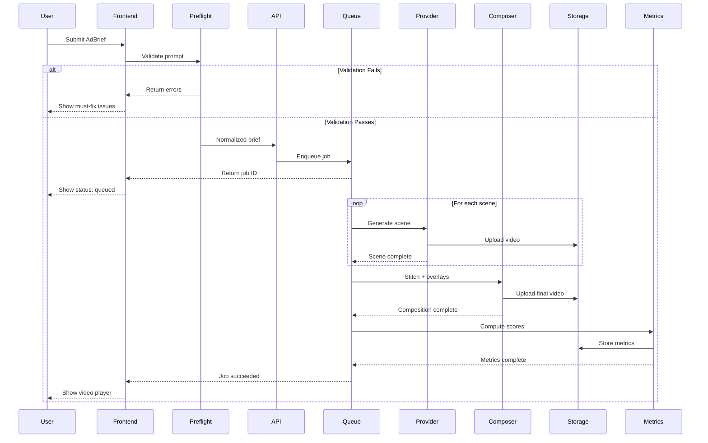
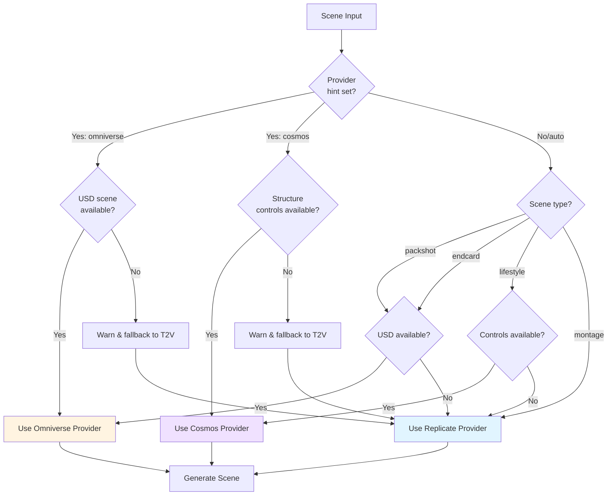
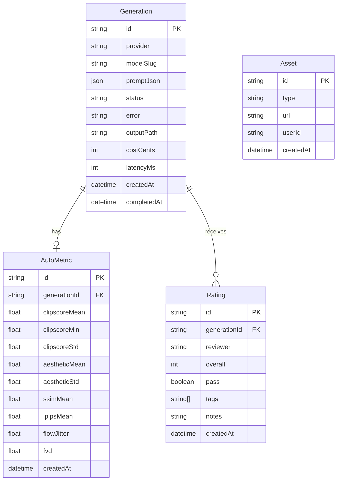
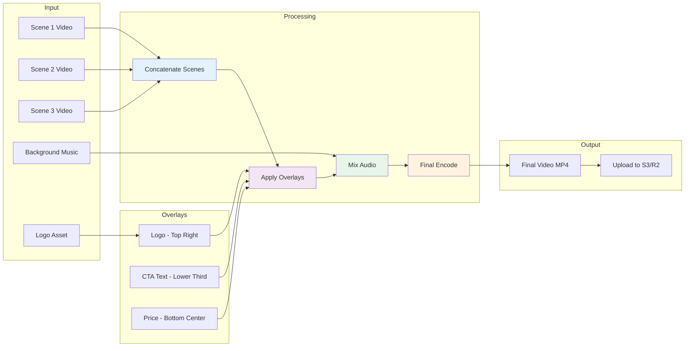
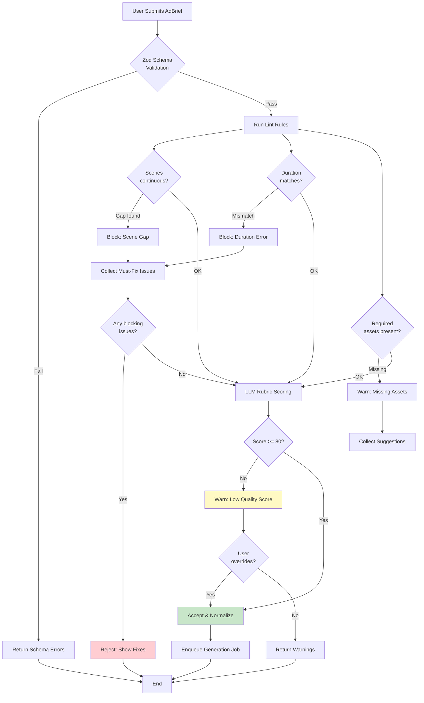
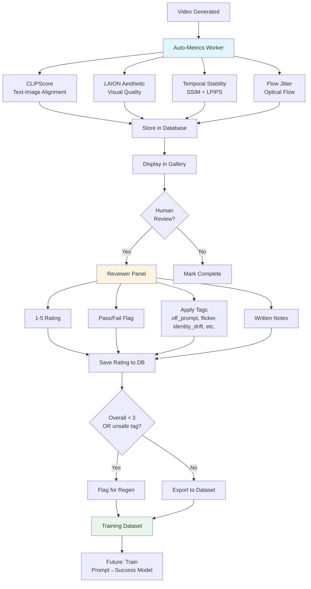
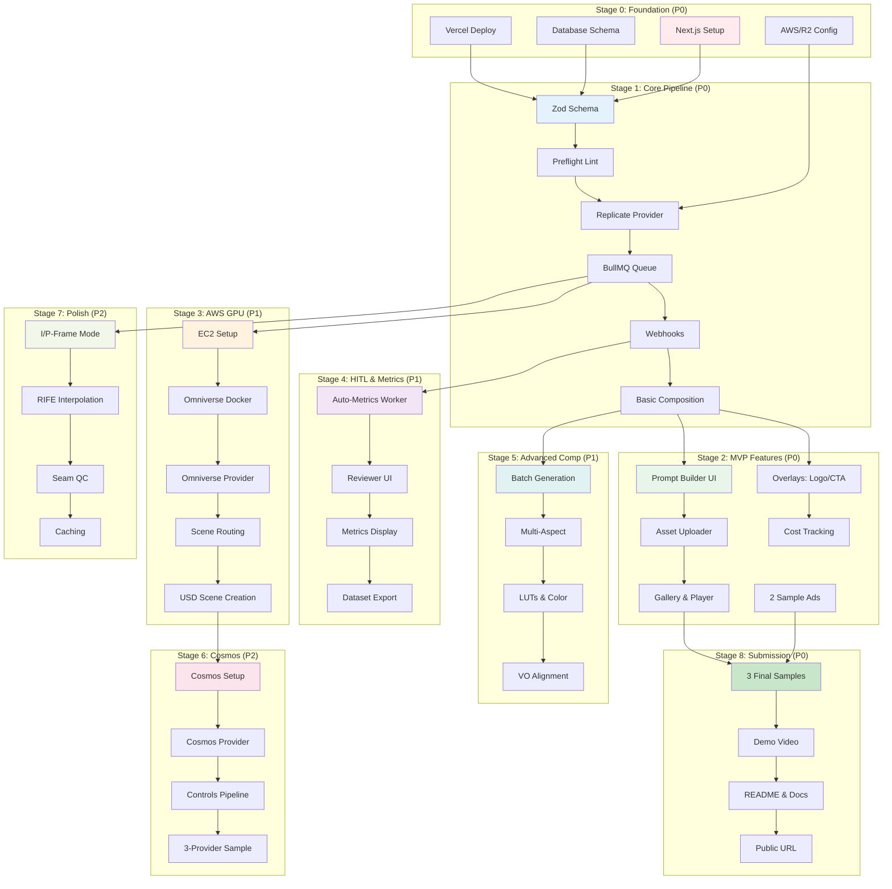
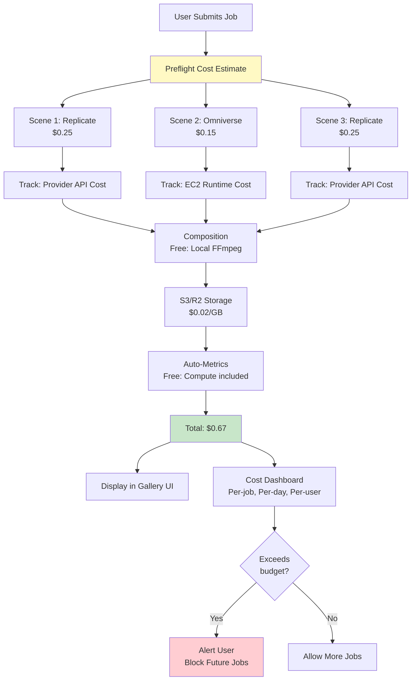
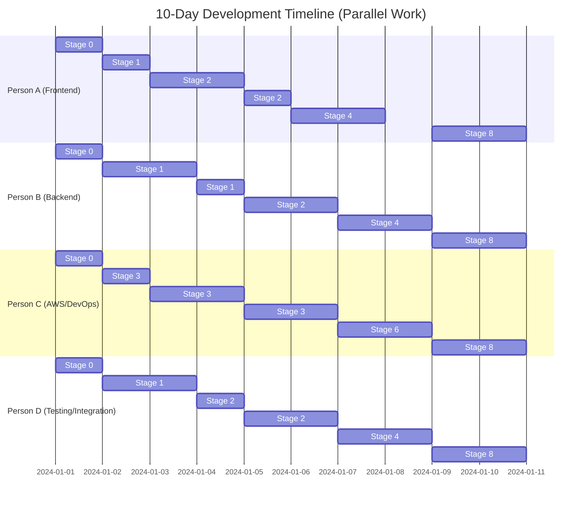

# AI Video Pipeline - Architecture Diagrams

This document contains Mermaid diagrams for the AI video generation pipeline. You can render these in GitHub, VS Code (with Mermaid extension), or any Mermaid-compatible viewer.

---

## 1. System Architecture (High-Level)

```mermaid
graph TB
    subgraph "Frontend (Next.js + React)"
        A[Prompt Builder UI]
        B[Brand Asset Manager]
        C[Gallery & Player]
        D[HITL Review Panel]
    end
    
    subgraph "Backend (Next.js API Routes)"
        E[/api/preflight]
        F[/api/generate]
        G[/api/webhook/*]
        H[/api/status/:id]
        I[/api/compose]
        J[/api/metrics]
    end
    
    subgraph "Job Queue"
        K[BullMQ Worker]
        L[Upstash Redis]
    end
    
    subgraph "Providers"
        M[Replicate API<br/>CogVideoX, SVD]
        N[AWS EC2<br/>Omniverse Kit]
        O[Cosmos API/NIM]
    end
    
    subgraph "Storage & Database"
        P[Neon Postgres]
        Q[S3/R2 Storage]
    end
    
    A --> E
    A --> F
    C --> H
    D --> J
    
    E --> P
    F --> K
    G --> P
    
    K --> M
    K --> N
    K --> O
    K --> I
    
    M --> Q
    N --> Q
    O --> Q
    
    I --> Q
    J --> P
    
    style M fill:#e1f5ff
    style N fill:#fff4e1
    style O fill:#f0e1ff
    style P fill:#e8f5e9
    style Q fill:#fff3e0
```

---

## 2. Request Flow (Scene Generation)



---

## 3. Provider Selection Logic



---

## 4. Database Schema (Entity Relationship)



---

## 5. Composition Pipeline (FFmpeg)



---

## 6. Preflight Validation Flow



---

## 7. HITL & Metrics Pipeline



---

## 8. Development Stages (Priority & Dependencies)



---

## 9. Cost Flow & Tracking



---

## 10. Team Parallel Workflow



---

## How to Use These Diagrams

### In GitHub
Simply view this markdown file - GitHub renders Mermaid automatically.

### In VS Code
1. Install "Markdown Preview Mermaid Support" extension
2. Open this file
3. Press `Ctrl+Shift+V` for preview

### Online Editors
- [Mermaid Live Editor](https://mermaid.live/)
- Copy any diagram code block and paste there

### In Documentation Sites
- These diagrams work in GitBook, Docusaurus, VitePress, etc.

### Export as Images
- Use Mermaid CLI: `mmdc -i ARCHITECTURE_DIAGRAMS.md -o diagrams/`
- Or use the Mermaid Live Editor export feature

---

## Diagram Summary

1. **System Architecture** - Overall component layout
2. **Request Flow** - End-to-end sequence for scene generation
3. **Provider Selection** - Decision tree for routing scenes
4. **Database Schema** - Entity relationships
5. **Composition Pipeline** - FFmpeg processing flow
6. **Preflight Validation** - Quality gating logic
7. **HITL & Metrics** - Review and scoring workflow
8. **Development Stages** - Task dependencies and priorities
9. **Cost Flow** - Budget tracking and alerts
10. **Team Workflow** - Parallel work Gantt chart

---

## Notes

- All diagrams are live-editable - update as architecture evolves
- Use `style` commands to color-code by priority or component type
- Export to PNG/SVG for presentations or pitch decks
- Keep diagrams in sync with `PIPELINE_ARCHITECTURE.md`

