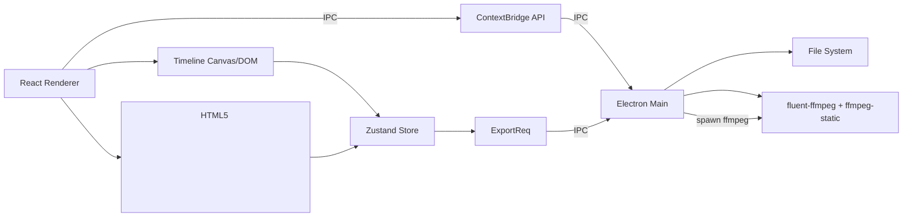
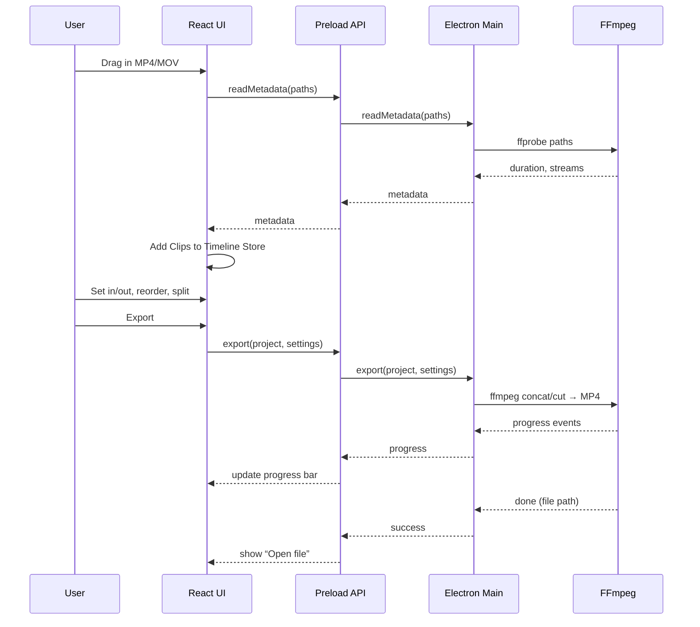

# ClipForge – Week 3 Starter Kit (Electron + React + TS)

This single doc gives you:
- A clear directional choice (with alternatives considered)
- A concise PRD tailored to the sprint
- Mermaid diagrams (architecture + key flows)
- A minimal, working codebase scaffold you can paste into Cursor and run

> Target: Hit MVP by **Tue Oct 28, 10:59 PM CT** with import → preview → trim → export working and a packaged desktop app.

---

## Directional Decision
**Chosen stack:**
- **Desktop:** Electron 32 + `electron-builder`
- **UI:** React + TypeScript + Vite
- **State:** Zustand (simple, predictable)
- **Media:** `ffmpeg-static` (bundled binaries) + `fluent-ffmpeg` (node-side). For quick export (concat/cuts) and MP4 output.
- **Recording (post‑MVP):** Electron `desktopCapturer` + `MediaRecorder` → WebM → ffmpeg → MP4; camera via `getUserMedia`.

**Why this now?** Electron is the fastest path to a packaged, cross‑platform MVP that can call native ffmpeg with minimal Rust/C++ glue. Tauri is leaner but screen capture on Win/mac requires more native work you don’t need before MVP.

**Alternatives considered:**
- **Tauri (Rust):** smaller bundle, fast; but screen capture APIs + ffmpeg invocation are more involved.
- **@ffmpeg/ffmpeg (wasm):** portable, but slower for long exports and larger payload. Good for some effects; not ideal for whole-video encode in 72h.

---

## PRD (condensed)
### Problem
Creators need a simple desktop editor to splice a few clips, trim, preview, and export to MP4 without wrestling with pro NLEs.

### Users & Scenarios
- **Solo creator/educator:** import 2–6 clips, trim heads/tails, add a screen recording, export 1080p MP4.

### MVP (hard gate)
1) Launchable desktop app (Electron)  
2) Import MP4/MOV via drag‑drop or picker  
3) Timeline view with clips  
4) Preview player  
5) Trim (set in/out on a single clip)  
6) Export to MP4  
7) Built as distributable (electron‑builder)

### Full Submission (core)
- Multi‑clip sequence on timeline; drag reorder; split at playhead; delete
- 2 tracks minimum (main + overlay/PiP placeholder)
- Basic metadata (duration, resolution) and thumbnails
- Export options: 720p / 1080p / source

### Stretch (only if time allows)
- Text overlays; simple crossfade; audio gain + fade; undo/redo; autosave; keyboard shortcuts

### Success Metrics
- Timeline responsive with 10+ short clips
- Smooth preview ≥30fps on typical laptop
- Export stable (no crashes) for a 2‑minute sequence
- Cold launch <5s on dev machine

### Risks & Mitigations
- **FFmpeg concat quirks** → Use `concat demuxer` with uniform codecs; else re‑encode each segment then concat.
- **Codec mismatch** → Normalize to H.264/AAC on import (optional pre‑transcode) or on export.
- **Large files** → Stream to temp file; show progress via `ffmpeg -progress` events.

---

## Mermaid Diagrams

### Architecture


### Import → Preview → Trim → Export


---

## File Tree
```
clipforge/
  package.json
  vite.config.ts
  tsconfig.json
  electron/
    main.ts
    preload.ts
  src/
    index.html
    renderer.tsx
    App.tsx
    store.ts
    components/
      Player.tsx
      Timeline.tsx
      ClipItem.tsx
      Toolbar.tsx
    lib/
      ff.ts   // export helpers (types, time utils)
      types.ts
  assets/
    icon.png
  .gitignore
  README.md
```

---

## Key Files (copy/paste)

### package.json
```json
{
  "name": "clipforge",
  "version": "0.1.0",
  "private": true,
  "main": "electron/main.js",
  "type": "module",
  "scripts": {
    "dev": "concurrently \"vite\" \"wait-on http://localhost:5173 && electron .\"",
    "build": "vite build && tsc -p electron && tsc -p .",
    "postinstall": "electron-builder install-app-deps",
    "pack": "electron-builder --dir",
    "dist": "electron-builder"
  },
  "dependencies": {
    "concurrently": "^9.0.0",
    "electron": "^32.1.0",
    "fluent-ffmpeg": "^2.1.2",
    "ffmpeg-static": "^5.2.0",
    "react": "^18.3.1",
    "react-dom": "^18.3.1",
    "zustand": "^4.5.2"
  },
  "devDependencies": {
    "@types/node": "^22.7.4",
    "@types/react": "^18.3.3",
    "@types/react-dom": "^18.3.0",
    "electron-builder": "^24.13.3",
    "typescript": "^5.6.2",
    "vite": "^5.4.6"
  },
  "build": {
    "appId": "ai.gauntlet.clipforge",
    "files": [
      "dist/**",
      "electron/**",
      "node_modules/**",
      "assets/**",
      "package.json"
    ],
    "extraResources": [
      {
        "from": "node_modules/ffmpeg-static/",
        "to": "ffmpeg/",
        "filter": ["**/*"]
      }
    ],
    "mac": { "category": "public.app-category.video" },
    "win": { "target": "nsis" },
    "linux": { "target": "AppImage" }
  }
}
```

### vite.config.ts
```ts
import { defineConfig } from 'vite'
import react from '@vitejs/plugin-react'
export default defineConfig({
  plugins: [react()],
  root: 'src',
  base: '',
  build: { outDir: '../dist', emptyOutDir: true }
})
```

### tsconfig.json (root)
```json
{
  "compilerOptions": {
    "target": "ES2022",
    "module": "ESNext",
    "moduleResolution": "Bundler",
    "jsx": "react-jsx",
    "strict": true,
    "baseUrl": ".",
    "paths": {},
    "skipLibCheck": true
  },
  "include": ["src/**/*", "electron/**/*"]
}
```

### electron/tsconfig.json
```json
{
  "compilerOptions": {
    "target": "ES2022",
    "module": "CommonJS",
    "outDir": "./",
    "esModuleInterop": true,
    "types": ["node"]
  },
  "include": ["main.ts", "preload.ts"]
}
```

### electron/main.ts
```ts
import { app, BrowserWindow, ipcMain, dialog } from 'electron'
import path from 'node:path'
import fs from 'node:fs'
import ffmpegPath from 'ffmpeg-static'
import ffmpeg from 'fluent-ffmpeg'

ffmpeg.setFfmpegPath(ffmpegPath as string)

let win: BrowserWindow | null = null

const createWindow = async () => {
  win = new BrowserWindow({
    width: 1280,
    height: 800,
    webPreferences: {
      preload: path.join(__dirname, 'preload.js'),
      contextIsolation: true,
      nodeIntegration: false
    }
  })

  if (process.env.VITE_DEV_SERVER_URL) {
    await win.loadURL(process.env.VITE_DEV_SERVER_URL)
  } else {
    await win.loadFile(path.join(__dirname, '../dist/index.html'))
  }
}

app.whenReady().then(createWindow)
app.on('window-all-closed', () => { if (process.platform !== 'darwin') app.quit() })
app.on('activate', () => { if (BrowserWindow.getAllWindows().length === 0) createWindow() })

ipcMain.handle('dialog:openFiles', async () => {
  const { canceled, filePaths } = await dialog.showOpenDialog(win!, {
    properties: ['openFile', 'multiSelections'],
    filters: [{ name: 'Video', extensions: ['mp4', 'mov', 'webm', 'mkv'] }]
  })
  return canceled ? [] : filePaths
})

ipcMain.handle('ffprobe:metadata', async (_e, filePath: string) => {
  return new Promise((resolve, reject) => {
    ffmpeg.ffprobe(filePath, (err, data) => {
      if (err) reject(err)
      else resolve({
        format: { duration: data.format.duration, size: data.format.size, format_name: data.format.format_name },
        streams: data.streams.map(s => ({ codec_type: s.codec_type, codec_name: s.codec_name, width: s.width, height: s.height }))
      })
    })
  })
})

ipcMain.handle('export:trim', async (_e, args: { input: string; outPath: string; start: number; end: number; }) => {
  const { input, outPath, start, end } = args
  await fs.promises.mkdir(path.dirname(outPath), { recursive: true })
  return new Promise((resolve, reject) => {
    const cmd = ffmpeg(input)
      .setStartTime(start)
      .setDuration(Math.max(0, end - start))
      .outputOptions(['-c:v libx264', '-preset veryfast', '-crf 23', '-c:a aac', '-b:a 128k'])
      .output(outPath)
      .on('progress', p => { win?.webContents.send('export:progress', p.percent ?? 0) })
      .on('end', () => resolve({ ok: true, outPath }))
      .on('error', err => reject(err))
      .run()
  })
})
```

### electron/preload.ts
```ts
import { contextBridge, ipcRenderer } from 'electron'

contextBridge.exposeInMainWorld('clipforge', {
  openFiles: (): Promise<string[]> => ipcRenderer.invoke('dialog:openFiles'),
  ffprobe: (filePath: string) => ipcRenderer.invoke('ffprobe:metadata', filePath),
  exportTrim: (payload: { input: string; outPath: string; start: number; end: number; }) =>
    ipcRenderer.invoke('export:trim', payload),
  onExportProgress: (cb: (pct: number) => void) => {
    ipcRenderer.removeAllListeners('export:progress')
    ipcRenderer.on('export:progress', (_e, pct: number) => cb(pct))
  }
})

declare global { interface Window { clipforge: any } }
```

### src/index.html
```html
<!doctype html>
<html>
  <head>
    <meta charset="UTF-8" />
    <meta http-equiv="Content-Security-Policy" content="default-src 'self'; media-src 'self' blob: file:; img-src 'self' blob: file:; style-src 'self' 'unsafe-inline'; script-src 'self'; connect-src 'self' http://localhost:*" />
    <meta name="viewport" content="width=device-width, initial-scale=1.0" />
    <title>ClipForge</title>
  </head>
  <body>
    <div id="root"></div>
    <script type="module" src="/renderer.tsx"></script>
  </body>
</html>
```

### src/renderer.tsx
```tsx
import React from 'react'
import { createRoot } from 'react-dom/client'
import App from './App'

createRoot(document.getElementById('root')!).render(<App />)
```

### src/lib/types.ts
```ts
export type Clip = {
  id: string
  path: string
  duration: number
  start: number // trim-in seconds
  end: number   // trim-out seconds
  width?: number
  height?: number
}
```

### src/store.ts
```ts
import { create } from 'zustand'
import { Clip } from './lib/types'

interface State {
  clips: Clip[]
  selectedId?: string
  playhead: number
  setClips: (c: Clip[]) => void
  addClips: (c: Clip[]) => void
  setTrim: (id: string, start: number, end: number) => void
  setPlayhead: (t: number) => void
  select: (id?: string) => void
}

export const useStore = create<State>((set) => ({
  clips: [],
  playhead: 0,
  setClips: (c) => set({ clips: c }),
  addClips: (c) => set(s => ({ clips: [...s.clips, ...c] })),
  setTrim: (id, start, end) => set(s => ({
    clips: s.clips.map(cl => cl.id === id ? { ...cl, start, end } : cl)
  })),
  setPlayhead: (t) => set({ playhead: t }),
  select: (id) => set({ selectedId: id })
}))
```

### src/lib/ff.ts
```ts
export const toHHMMSS = (t: number) => new Date(t * 1000).toISOString().substring(11, 19)
export const clamp = (v: number, min: number, max: number) => Math.max(min, Math.min(max, v))
```

### src/components/Toolbar.tsx
```tsx
import React, { useState } from 'react'
import { useStore } from '../store'

export default function Toolbar() {
  const [progress, setProgress] = useState(0)
  const { clips } = useStore()

  React.useEffect(() => {
    window.clipforge.onExportProgress((p: number) => setProgress(p))
  }, [])

  const onImport = async () => {
    const files: string[] = await window.clipforge.openFiles()
    const metas = await Promise.all(files.map(async f => {
      const info = await window.clipforge.ffprobe(f)
      const dur = Number(info.format.duration) || 0
      const v = info.streams.find((s: any) => s.codec_type === 'video')
      return { path: f, duration: dur, width: v?.width, height: v?.height }
    }))
    const payload = metas.map((m, i) => ({ id: crypto.randomUUID(), path: m.path, duration: m.duration, start: 0, end: m.duration, width: m.width, height: m.height }))
    useStore.getState().addClips(payload)
  }

  const exportSelected = async () => {
    const sel = useStore.getState().clips[0]
    if (!sel) return alert('Import a clip first')
    const out = `${sel.path}.trimmed.mp4`
    await window.clipforge.exportTrim({ input: sel.path, outPath: out, start: sel.start, end: sel.end })
    alert('Export complete:\n' + out)
  }

  return (
    <div style={{ display:'flex', gap: 8, padding: 8, borderBottom: '1px solid #eee' }}>
      <button onClick={onImport}>Import</button>
      <button onClick={exportSelected}>Export Selected (Trim)</button>
      <div style={{ marginLeft: 'auto' }}>{progress ? `Export: ${progress.toFixed(0)}%` : ''}</div>
    </div>
  )
}
```

### src/components/Player.tsx
```tsx
import React, { useEffect, useRef, useState } from 'react'
import { useStore } from '../store'

export default function Player() {
  const videoRef = useRef<HTMLVideoElement>(null)
  const { clips, playhead, setPlayhead } = useStore()
  const sel = clips[0]
  const [url, setUrl] = useState<string>()

  useEffect(() => {
    if (sel) setUrl(`file://${sel.path.replace(/\\/g, '/')}`)
  }, [sel?.path])

  useEffect(() => {
    const v = videoRef.current
    if (!v) return
    const onTime = () => setPlayhead(v.currentTime)
    v.addEventListener('timeupdate', onTime)
    return () => v.removeEventListener('timeupdate', onTime)
  }, [])

  if (!sel) return <div style={{ padding: 16 }}>Import a clip to preview</div>

  return (
    <div style={{ display:'grid', placeItems:'center', height: 420, background:'#111' }}>
      <video ref={videoRef} src={url} controls style={{ maxWidth:'100%', maxHeight:'100%' }} />
    </div>
  )
}
```

### src/components/Timeline.tsx
```tsx
import React from 'react'
import { useStore } from '../store'
import { clamp } from '../lib/ff'

export default function Timeline() {
  const { clips, setTrim } = useStore()
  const sel = clips[0]
  if (!sel) return <div style={{ padding: 16 }}>Timeline: (empty)</div>

  const width = 800
  const pxPerSec = width / Math.max(1, sel.duration)
  const left = sel.start * pxPerSec
  const right = sel.end * pxPerSec

  const onDrag = (which: 'start'|'end', e: React.MouseEvent<HTMLDivElement>) => {
    const rect = (e.currentTarget.parentElement as HTMLDivElement).getBoundingClientRect()
    const x = clamp(e.clientX - rect.left, 0, width)
    const t = x / pxPerSec
    const start = which === 'start' ? clamp(t, 0, sel.end - 0.1) : sel.start
    const end = which === 'end' ? clamp(t, sel.start + 0.1, sel.duration) : sel.end
    setTrim(sel.id, start, end)
  }

  return (
    <div style={{ padding: 16 }}>
      <div style={{ width, height: 64, position:'relative', background:'#fafafa', border:'1px solid #ddd', margin:'8px 0' }}>
        <div style={{ position:'absolute', left: left, width: Math.max(2, right-left), top:0, bottom:0, background:'#cde4ff' }} />
        <div onMouseDown={(e)=>{ const move=(ev:MouseEvent)=>onDrag('start', ev as any); const up=()=>{window.removeEventListener('mousemove',move);window.removeEventListener('mouseup',up)}; window.addEventListener('mousemove',move); window.addEventListener('mouseup',up)}}
             style={{ position:'absolute', left: left-4, top:0, bottom:0, width:8, background:'#1e90ff', cursor:'ew-resize' }} />
        <div onMouseDown={(e)=>{ const move=(ev:MouseEvent)=>onDrag('end', ev as any); const up=()=>{window.removeEventListener('mousemove',move);window.removeEventListener('mouseup',up)}; window.addEventListener('mousemove',move); window.addEventListener('mouseup',up)}}
             style={{ position:'absolute', left: right-4, top:0, bottom:0, width:8, background:'#1e90ff', cursor:'ew-resize' }} />
      </div>
      <div style={{ fontSize:12, color:'#666' }}>Start: {sel.start.toFixed(2)}s | End: {sel.end.toFixed(2)}s | Duration: {(sel.end - sel.start).toFixed(2)}s</div>
    </div>
  )
}
```

### src/App.tsx
```tsx
import React from 'react'
import Toolbar from './components/Toolbar'
import Player from './components/Player'
import Timeline from './components/Timeline'

export default function App() {
  return (
    <div style={{ display:'grid', gridTemplateRows:'auto auto 1fr', height:'100vh' }}>
      <Toolbar />
      <Player />
      <Timeline />
    </div>
  )
}
```

### .gitignore
```
/node_modules
/dist
/out
/.vite
.DS_Store
Thumbs.db
*.log
*.mp4
*.mov
*.webm
*.mkv
*.tmp
/_release
```

### README.md
```md
# ClipForge

A tiny desktop video trimmer/editor built in 72h. MVP: import → preview → trim → export MP4.

## Quickstart
```bash
# Node 20+ recommended
pnpm i  # or npm i / yarn
pnpm dev
```
- Electron opens after Vite dev server is ready.

## Build / Package
```bash
pnpm build
pnpm dist
```
Artifacts go to `dist/` (Vite) and `dist/`/`release` (electron-builder).

## Features (MVP)
- Import MP4/MOV/WebM
- Preview via HTML5 video
- Trim in/out on first clip
- Export to H.264/AAC MP4 using ffmpeg

## Next Up
- Multi-clip timeline with reorder + split
- Screen + webcam recording (Electron desktopCapturer + MediaRecorder)
- Export presets (720p/1080p/source)
- Progress UI + cancel

## Notes
- `ffmpeg-static` ships platform binaries. electron-builder copies them under `resources/ffmpeg`.
- If export fails, inspect console logs from Main process.
```

---

## What to build next (after MVP)
1) **Split & Reorder**: implement multiple clips; render timeline lane with draggable items; export via concat demuxer.
2) **Recording**: add `start/stop` to capture screen/webcam → write WebM → push to media library.
3) **Two Tracks**: overlay placeholder (PiP) – compute layout and use ffmpeg filter graph during export.
4) **Export Options**: dropdown (source/720p/1080p), fps normalization, bitrate presets.

---

## Minimal Task Board
- [ ] MVP import/preview/trim/export (this scaffold)
- [ ] Package app on Win + Mac
- [ ] Multi-clip timeline + split at playhead
- [ ] Export concat for N clips
- [ ] Screen recording
- [ ] Webcam + PiP
- [ ] Save/load project JSON
```

